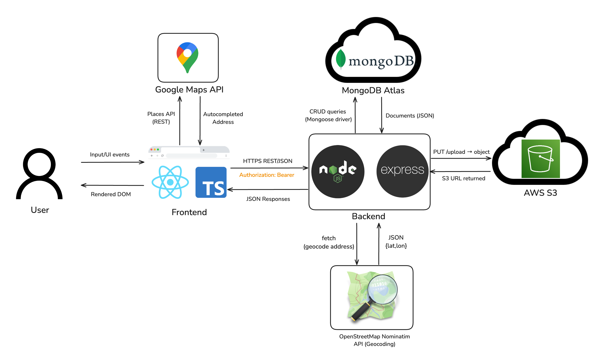

# rentora

A full-stack short-term-rental app: travelers can search, filter, book and pay; hosts can list, manage availability, and upload images.

---

## 📋 Overview

rentora provides a marketplace where:

- **Hosts** list rooms, homes or apartments for short stays
- **Guests** search by location, dates and filters, then book
- **Guests & hosts** chat, rate, and manage their bookings (Work in progress)

Unlike Airbnb, our MVP focuses on simplicity and gets you up-and-running with:

- Property CRUD
- Rich search & filtering (date availability, geolocation, price)
- Booking engine (no overlaps, date validation)
- Image upload to S3
- JWT-backed auth
- Geocoding via Nominatim

---

## 🛠️ Tech Stack

- **Frontend:** React, TypeScript, Vite, Tailwind CSS, Google Maps Places API
- **Backend:** Node.js, Express
- **Database:** MongoDB Atlas
- **File Storage:** AWS S3
- **Geocoding:** OpenStreetMap Nominatim
- **Auth:** JWT (JSON Web Tokens)
- **Testing:** Jest, Supertest

---

## ▶️ Demo Video

- [Watch the Demo on YouTube](https://youtu.be/8v7s5UwhEvo)

---

## ⚙️ Prerequisites

- Node.js ≥ 16 + npm
- Docker & Docker Compose (optional, for containerized dev)
- An AWS account & S3 bucket
- MongoDB Atlas cluster
- Google Maps API key if you swap in Google geocoding

---

## 📐 Server Architecture



---

## 🔒 Environment Variables

Create a `.env` file in `/server`:

```dotenv
MONGO_URI="mongodb+srv://<user>:<pass>@cluster0/productionDB?retryWrites=true&w=majority"
MONGO_URI_TEST="mongodb+srv://<user>:<pass>@cluster0/testDB?retryWrites=true&w=majority"
JWT_SECRET="your_jwt_secret_here"
AWS_ACCESS_KEY_ID="YOUR_AWS_KEY"
AWS_SECRET_ACCESS_KEY="YOUR_AWS_SECRET"
AWS_REGION="us-east-2"
AWS_BUCKET="your-s3-bucket-name"
```

> **Never** commit `.env`—it’s in `.gitignore`.

---

## 🏃 Running Locally

You’ll need **two** terminals:

### 1. Frontend

```bash
cd my-react-router-app
npm install
npm run dev
```

Visit: `http://localhost:5173`

### 2. Backend

```bash
cd server
npm install
npm run start
```

API root: `http://localhost:3001`

---

## 🐳 Docker

```bash
docker compose up --build
```

- Frontend → http://localhost:5173
- Backend → http://localhost:3001

---

## 🧪 Testing

From the **server/** folder:

```bash
npm test
```

- Uses `MONGO_URI_TEST`
- Runs Jest & Supertest
- Generates a coverage report (aim ≥ 80%)
- Currently at 83.89% coverage

---

## 🔗 API Reference

### Auth

| Method | Path           | Body                  | Success Response                        |
| ------ | -------------- | --------------------- | --------------------------------------- |
| POST   | `/auth/signup` | `{ email, password }` | `201 { message, userId, email }`        |
| POST   | `/auth/login`  | `{ email, password }` | `200 { message, token, userId, email }` |

---

### Properties

| Method | Path              | Query                                                                                    | Body                                                                                                                         |
| ------ | ----------------- | ---------------------------------------------------------------------------------------- | ---------------------------------------------------------------------------------------------------------------------------- |
| POST   | `/properties`     | —                                                                                        | `{ title, description, location:{address,city,state,zip,country}, price, rooms, propertyType, hostId, images?, amenities? }` |
| GET    | `/properties`     | `?checkIn&checkOut`, `?latitude&longitude&radius`, `?minPrice&maxPrice`, `?propertyType` | —                                                                                                                            |
| GET    | `/properties/:id` | —                                                                                        | —                                                                                                                            |
| PUT    | `/properties/:id` | —                                                                                        | Any subset of the create-body fields; geocoding runs if location changed                                                     |
| DELETE | `/properties/:id` | —                                                                                        | —                                                                                                                            |

---

### Bookings

| Method | Path                       | Body                                         |
| ------ | -------------------------- | -------------------------------------------- |
| POST   | `/bookings`                | `{ propertyId, userId, startDate, endDate }` |
| GET    | `/bookings`                | —                                            |
| GET    | `/properties/:id/bookings` | —                                            |

---

### Image Upload

| Method | Path                        | Form-Data Field(s)     | Description                                              |
| ------ | --------------------------- | ---------------------- | -------------------------------------------------------- |
| POST   | `/image/upload/:propertyId` | `images` (one or many) | Saves files to S3 and pushes URLs onto `property.images` |

---

## 🎯 Future Enhancements

- Cross-platform compatibility (web & mobile)
- Reliable second-image upload during edits
- Improved calendar usability on the Edit Page
- Responsive UI/UX
- Review & rating system
- In-app chat support
- Seamless payment integration
- CI/CD pipeline & production deployment
